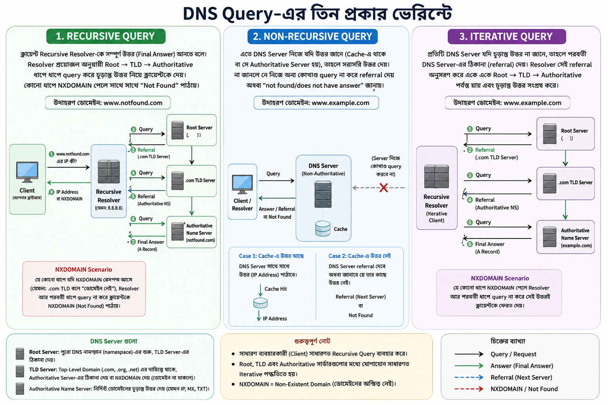
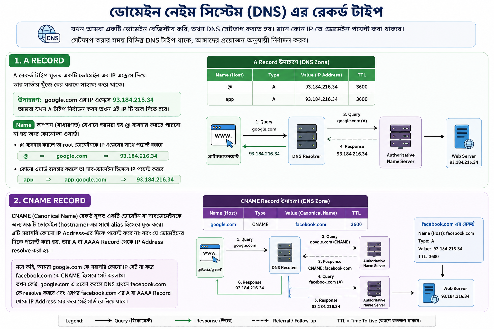

## DNS Query Types

DNS এ তিন প্রকারের query থাকে, যার মাধ্যমে DNS সার্ভার রিকোয়েস্ট কে প্রসেস করতে পারে।

- **Recursive Query:** এতে DNS resolver থেকে যতক্ষণ না পর্যন্ত রেসপন্স না পাওয়া যায় ততক্ষন DNS সার্চ query মানে Root সার্ভার থেকে শুরু করে Authoritative সার্ভার পর্যন্ত প্রসেস চলতে থাকবে। যদি NXDOMAIN (Non-Existent Domain) পায় তাহলে আর সার্চ করবে না সরাসরি "not found" মেসেজ পাঠিয়ে দিবে। মনে করি, আমাদের ডোমেইন `www.notfound.com`

  - প্রথমে **Recursive Resolver** Root Server-এ query পাঠায়। Root Server `.com` ডোমেইনের জন্য দায়িত্বপ্রাপ্ত **TLD Server**-এর তথ্য (referral) ফিরিয়ে দেয়।
  - এরপর Recursive Resolver সেই **TLD Server**-এ query পাঠায়। ডোমেইনটি যদি নিবন্ধিত (registered) থাকে, তাহলে TLD Server সেই ডোমেইনের **Authoritative Name Server**-এর তথ্য (referral) দেয়।
  - এরপর Recursive Resolver Authoritative Name Server-এ query পাঠায় এবং সেখান থেকে চূড়ান্ত উত্তর (যেমন A Record-এর IP Address) পেয়ে ক্লায়েন্টকে জানিয়ে দেয়।
  - এই পর্যায়গুলোর যেকোনো ধাপে যদি DNS Server থেকে **NXDOMAIN (Non-Existent Domain)** রেসপন্স পাওয়া যায়, তাহলে Recursive Resolver পরবর্তী কোনো ধাপে না গিয়ে সরাসরি ক্লায়েন্টকে জানিয়ে দেয় যে ডোমেইনটির অস্তিত্ব নেই।

- **Non-recursive Query:** এই ধরনের query-তে DNS Server যদি নিজের cache বা authoritative zone থেকে উত্তর দিতে পারে, তাহলে সরাসরি সেই উত্তর ক্লায়েন্টকে পাঠিয়ে দেয়। কিন্তু উত্তর জানা না থাকলে সে অন্য কোনো DNS Server-এর কাছে query চালায় না। অর্থাৎ, সে recursion করে না।

- **Iterative Query:** এতে DNS Resolver প্রথমে তার নিকটবর্তী সার্ভাররের(DNS Cache) কাছে থেকে ইনফরমেশন নিয়ে আসবে, আর যদি না পায় তাহলে next available DNS সার্ভার এর মধ্যে আবার query করবে। যদি NXDOMAIN (Non-Existent Domain) পায় তাহলে আর করি করবে না directly "not found" মেসেজ পাঠিয়ে দিবে।

<p align="center">
  
</p>

## DNS Cache

উপরের পুরো প্রক্রিয়াটা (Root → TLD → Authoritative Server পর্যন্ত যাওয়া) প্রতিবার করলে অনেক সময় লাগবে এবং DNS Server-গুলোর উপর প্রচুর load পড়বে। এই সমস্যা সমাধানের জন্য ব্যবহার হয় **DNS Cache** - মানে একবার কোনো ডোমেইনের উত্তর পাওয়ার পর সেটা কিছুক্ষণের জন্য মনে (store) রাখা হয়, যাতে বারবার একই query না পাঠাতে হয়।

DNS Cache মূলত কয়েক জায়গায় হতে পারে:

- **Browser Cache** — ব্রাউজার নিজেই সাম্প্রতিক DNS lookup-গুলো ছোট সময়ের জন্য মনে রাখে।
- **OS (Operating System) Cache** — অপারেটিং সিস্টেম লেভেলেও একটা DNS cache থাকে, যেখানে সব অ্যাপ্লিকেশন একসাথে সুবিধা পায়।
- **Recursive Resolver Cache** — ISP বা তোমার ব্যবহৃত Recursive Resolver (যেমন Google DNS বা Cloudflare DNS) নিজেও রেসপন্স cache করে রাখে, যাতে অন্য ইউজারদের জন্যও একই ডোমেইনের query দ্রুত সমাধান করা যায়।

প্রতিটা DNS Record-এর সাথে একটা **TTL (Time To Live)** ভ্যালু থাকে, যা নির্ধারণ করে সেই record কতক্ষণ পর্যন্ত cache-এ রাখা যাবে। TTL শেষ হয়ে গেলে cache থেকে সেই এন্ট্রি মুছে যায়, এবং পরের বার query আসলে আবার পুরো resolution প্রক্রিয়া (Root থেকে শুরু করে) নতুন করে চালাতে হয়।

**সংক্ষেপে:** DNS Cache-এর মূল উদ্দেশ্য হলো বারবার একই resolution প্রক্রিয়া না চালিয়ে দ্রুত উত্তর দেওয়া, যার ফলে ওয়েবসাইট লোড হতে কম সময় লাগে এবং DNS infrastructure-এর উপর চাপও কমে।

### TTL-এর Example

ধরা যাক, `example.com` ডোমেইনের A Record-এর TTL সেট করা আছে **3600 সেকেন্ড (১ ঘণ্টা)**। এখন ঘটনাটা এভাবে ঘটবে:

- ধরি, দুপুর ১২টায় প্রথমবার কেউ `example.com` ভিজিট করলো। তখন Recursive Resolver পুরো resolution প্রক্রিয়া (Root → TLD → Authoritative) চালিয়ে IP Address বের করলো এবং সেটা নিজের cache-এ **1 ঘণ্টার জন্য** সংরক্ষণ করে রাখলো।
- দুপুর ১২টা ৩০ মিনিটে যদি অন্য কোনো ইউজার একই ডোমেইন ভিজিট করে, তাহলে Recursive Resolver আর নতুন করে Root/TLD/Authoritative Server-এ query পাঠাবে না। সরাসরি cache থেকে IP Address দিয়ে দেবে — ফলে উত্তর আসবে অনেক দ্রুত।
- দুপুর ১টার পর (অর্থাৎ TTL শেষ হয়ে যাওয়ার পর) যদি কেউ আবার `example.com` ভিজিট করে, তাহলে cache-এ থাকা এন্ট্রিটি expired ধরা হবে, এবং Recursive Resolver-কে আবার নতুন করে পুরো resolution প্রক্রিয়া চালাতে হবে।

**লক্ষ্যণীয় বিষয়:** যদি কোনো ডোমেইনের IP Address ঘন ঘন পরিবর্তন হয় (যেমন load balancing বা failover-এর জন্য), তাহলে সাধারণত TTL-এর মান **কম** রাখা হয় (যেমন ৬০-৩০০ সেকেন্ড), যাতে পরিবর্তনটা দ্রুত সবার কাছে পৌঁছায়। আর যেসব ডোমেইনের IP প্রায় কখনো বদলায় না, সেখানে TTL-এর মান **বেশি** (যেমন ২৪ ঘণ্টা বা তার বেশি) রাখা হয়, যাতে বারবার query না করতে হয় এবং resolution দ্রুত হয়।

### DNS Cache Practical (নিজের কম্পিউটারে চেক করুন)

আপনি চাইলে নিজের কম্পিউটারেই OS-Level DNS Cache দেখতে এবং পরীক্ষা করতে পারেন।

**Windows-এ:**

```bash
# বর্তমান DNS Cache-এর সব এন্ট্রি দেখতে
ipconfig /displaydns

# DNS Cache ক্লিয়ার করতে (flush)
ipconfig /flushdns
```

**macOS-এ:**

macOS-এ Windows-এর মতো ipconfig /displaydns এর সরাসরি কোনো equivalent নেই - অর্থাৎ পুরো DNS cache-এর লিস্ট এক কমান্ডে দেখার সহজ উপায় নেই।

**Linux-এ (systemd-resolved ব্যবহারকারী হলে):**

```bash
# DNS Cache-এর statistics দেখতে
sudo systemd-resolve --statistics

# DNS Cache ক্লিয়ার করতে
sudo systemd-resolve --flush-caches
```

### একটা ছোট experiment করে দেখতে পারেন

1. প্রথমে `ipconfig /flushdns` (বা আপনার OS অনুযায়ী কমান্ড) চালিয়ে cache খালি করুন।
2. এরপর একটা নতুন ডোমেইন visit করুন (যেমন ব্রাউজারে টাইপ করে), বা টার্মিনালে `nslookup example.com` চালান।
3. প্রথমবার resolution-এ সামান্য বেশি সময় লাগবে, কারণ পুরো Root → TLD → Authoritative প্রক্রিয়া চলবে।
4. একই কমান্ড আবার চালালে দেখবেন উত্তর প্রায় সাথে সাথে চলে আসছে — কারণ এবার এটা cache থেকে সার্ভ হচ্ছে।

**সংক্ষেপে:** DNS Cache কোনো abstract concept না, বরং আপনার নিজের ডিভাইসেই সক্রিয়ভাবে কাজ করছে। উপরের কমান্ডগুলো দিয়ে আপনি হাতে-কলমে দেখতে পারবেন কীভাবে TTL শেষ হওয়ার আগ পর্যন্ত রেসপন্স দ্রুত আসে, আর flush করার পর আবার নতুন করে resolution প্রক্রিয়া শুরু হয়।

## ডোমেইন নেইম সিস্টেম(DNS) এর রেকর্ড টাইপ

যখন আমরা একটি ডোমেইন রেজিস্টার করতে যাই, তখন আমাদের DNS সেটআপ করে দিতে হয়। মানে কোন IP তে ডোমেইন পয়েন্ট করা থাকবে। সেটআপ করার সময় কিছু DNS টাইপ থাকে, আমাদের প্রয়োজন অনুযায়ী নির্বাচন করব।

- **A:** A রেকর্ড টাইপ মূলত একটি ডোমেইন এর IP এড্রেস দিয়ে তার সার্ভার খুঁজে বের করতে সাহায্য করে থাকে। মনে করি, আমাদের ডোমেইন হচ্ছে google.com এবং তার IP এড্রেস হচ্ছে 93.184.216.34, আমরা যখন A টাইপ নির্বাচন করব তখন IP টি বলে দিতে হবে।

  এখন আরেকটি অপসন থাকে যাকে Name বলা হয় সাধারণত, যেখানে আমরা হয় @ ব্যবহার করতে পারবো না হয় অন্য কোনো ওয়ার্ড।

  যদি আমরা @ ব্যবহার করি তাহলে তা root ডোমেইনকে IP এড্রেস এর সাথে পয়েন্ট করবে।

  @ => google.com => 93.184.216.34

  যদি ওয়ার্ড হিসাবে app ব্যবহার করি তাহলে সেটি সাব-ডোমেইন হিসেবে IP পয়েন্ট করা হবে।

  app.google.com => 93.184.216.34

- **CNAME:** CNAME (Canonical Name) রেকর্ড মূলত একটি ডোমেইন বা সাবডোমেইনকে অন্য একটি **ডোমেইন (hostname)**-এর সাথে alias হিসেবে যুক্ত করে। এটি সরাসরি কোনো **IP Address**-এর দিকে পয়েন্ট করে না; বরং যে ডোমেইনের দিকে পয়েন্ট করা হয়, তার A বা AAAA Record থেকে IP Address resolve করা হয়।

মনে করি, আমাদের ডোমেইন `google.com`। এখন আমরা এতে সরাসরি কোনো IP Address সেট না করে `facebook.com`-কে CNAME হিসেবে সেট করলাম। তখন কেউ `google.com`-এ প্রবেশ করলে DNS প্রথমে `facebook.com`-কে resolve করবে এবং এরপর `facebook.com`-এর A বা AAAA Record থেকে IP Address বের করে সেই সার্ভারে নিয়ে যাবে।

<p align="center">
  
</p>

## DNS Zone

DNS Zone হলো DNS এর একটি portion যেখানে একটি নির্দিষ্ট ডোমেইন এবং সাবডোমাইন একটি administrator দ্বারা নিয়ন্ত্রিত হয়ে থাকে। উদাহরণ

- Route53
- Cloudflare DNs

## localhost এবং 127.0.0.1 এর পার্থক্য কি?

দুটির মূলত একটি কাজ, আপনার নিজের ল্যাপটপ কে পয়েন্ট করা। তবে পার্থক্য আছে,

- localhost হলো hostname। যা আমাদের অপারেটিং সিস্টেম resolve করে থাকে। অর্থাৎ, localhost -> 127.0.0.1

- 127.0.0.1 হলো IP Address। যেহেতু এটি নিজে একটি IP Address সেহেতু তাকে resolve করার প্রয়োজন নাই।
